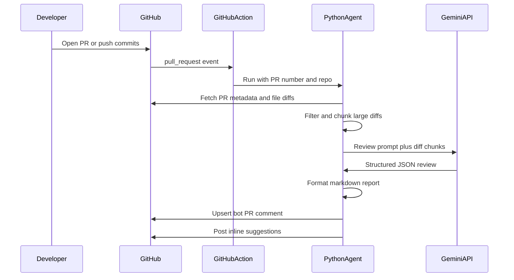

# AI Code Review Agent

Automated first-pass pull request reviews powered by **Google Gemini**. When a PR is opened or updated, a GitHub Action analyzes the diff and posts structured feedback before human reviewers step in.

## What it reviews

- Potential bugs and logic errors
- Security issues (injection, auth, secrets)
- Performance concerns
- Code quality and maintainability
- Missing edge cases
- Suggested tests and improvements

The agent posts:

1. A **summary PR comment** (updated in place on each push — no spam)
2. **Inline comments** on specific lines for `critical` and `warning` findings when a line number can be inferred from the diff

## Project structure

```text
air-review-coding-agent/
├── .github/workflows/ai-code-review.yml
├── src/air_review/
│   ├── main.py
│   ├── config.py
│   ├── github_client.py
│   ├── gemini_client.py
│   ├── diff_processor.py
│   └── prompts.py
├── review_config.yaml
├── requirements.txt
└── tests/
```

## Setup

### 1. Get a Gemini API key

Create an API key at [Google AI Studio](https://aistudio.google.com/apikey).

### 2. Add GitHub secret

In your GitHub repo:

**Settings → Secrets and variables → Actions → New repository secret**

| Secret | Value |
|--------|-------|
| `GEMINI_API_KEY` | Your Gemini API key |

`GITHUB_TOKEN` is provided automatically by GitHub Actions.

### 3. Push this repo to GitHub

Ensure GitHub Actions are enabled for the repository.

### 4. Open a test PR

Create or update a pull request. Within a minute or two, you should see an **AI Code Review (Gemini)** comment on the PR.

## Configuration

Edit [`review_config.yaml`](review_config.yaml):

```yaml
model: gemini-2.5-pro
bot_name: "AIR Review"
bot_id: "air-review"
max_files: 40
max_patch_bytes: 120000
chunk_patch_bytes: 50000
ignore_patterns:
  - "package-lock.json"
  - "dist/**"
skip_labels:
  - "no-ai-review"
inline_comment_severities:
  - "critical"
  - "warning"
```

- `bot_name` — display name shown in review comments (e.g. `Simulanis Review Bot`)
- `bot_id` — stable ID used to find/update the same PR comment; change only if you want a fresh comment thread

Add the `no-ai-review` label to any PR to skip automated review.

## Local testing

```powershell
cd C:\Users\Simulanis\Downloads\air-review-coding-agent
python -m venv .venv
.venv\Scripts\activate
pip install -r requirements.txt
copy .env.example .env
```

Fill in `.env`:

```env
GEMINI_API_KEY=your-gemini-api-key
GITHUB_TOKEN=ghp_your_personal_access_token
```

Your GitHub token needs `repo` scope (or `public_repo` for public repositories) with read/write access to pull requests.

Run against a real PR:

```powershell
$env:PYTHONPATH = "src"
python -m air_review.main --pr 1 --repo owner/repo
```

Skip inline comments locally:

```powershell
python -m air_review.main --pr 1 --repo owner/repo --no-inline
```

## Run tests

```powershell
pip install pytest
$env:PYTHONPATH = "src"
pytest
```

## How it works



## Troubleshooting

| Issue | Fix |
|-------|-----|
| Workflow does not run | Confirm Actions are enabled and the workflow file is on the default branch |
| `GEMINI_API_KEY is required` | Add the secret in repo Settings → Secrets |
| No inline comments | Line numbers must be inferable from diff hunks; binary or deleted-only files may not support inline comments |
| Partial review notice | Large PRs are capped by `max_files` and `max_patch_bytes` to control cost |
| Skip review for a PR | Add the `no-ai-review` label |

## Security notes

- Never commit `.env` or API keys.
- The workflow only reads repo contents and writes PR comments.
- Diff size limits help control Gemini API usage.

## License

MIT
